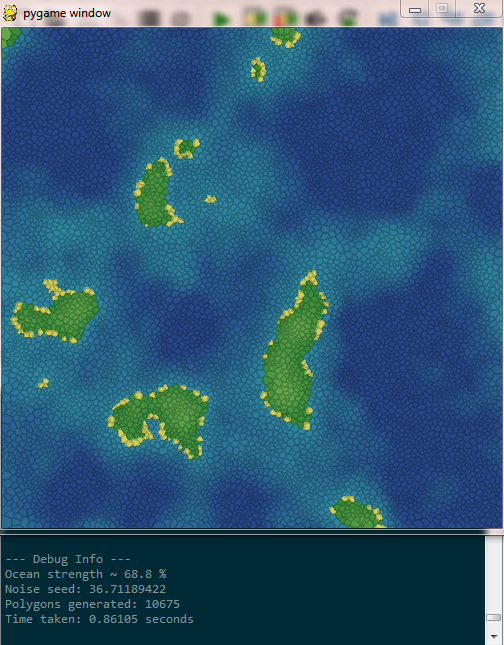
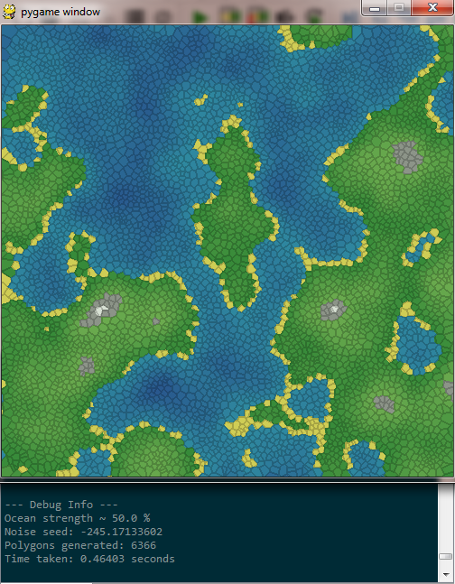
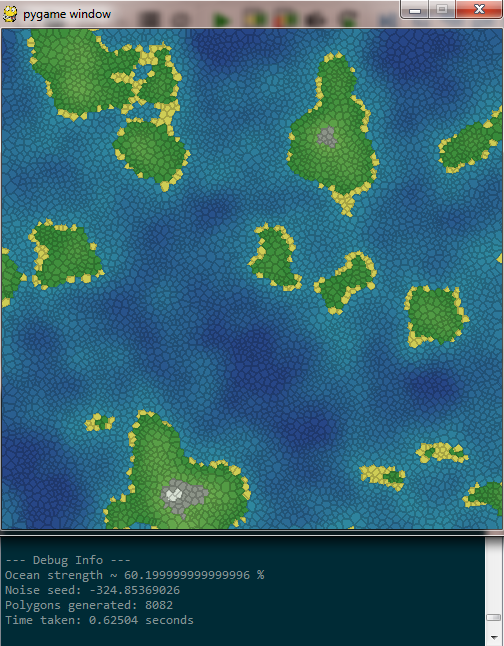

# world-generation
Using voronoi polygonal meshes to procedurually generate terrain maps

Run main.py", hit R to regenerate landscapes.

This is a small part of a much larger project I'm working on, but it can stand alone as a fun toy in its own right.
If you wand to change any of the settings you'll have to go into the "makedict" file and change the hardcorded constants there since I haven't bothered putting a GUI in yet.

Example Screenshots
-------

